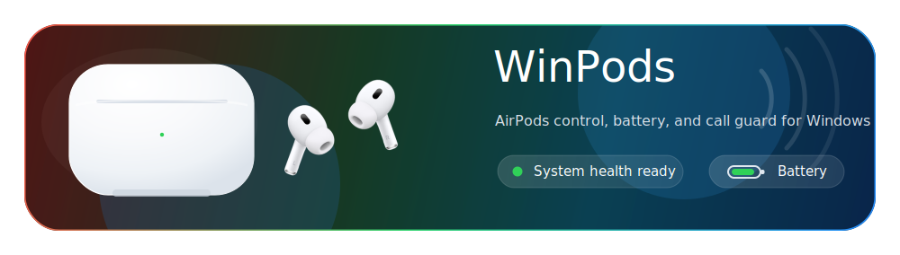

# WinPods

<p align="center">
  
</p>

WinPods is a Windows tray app for AirPods and Beats. It shows battery, helps you keep your own AirPods pinned in busy Bluetooth areas, controls AirPods Pro listening modes, and protects call audio from Windows Bluetooth headset downgrade.

## Quick Start

1. Download the latest installer from [Releases](https://github.com/ValentinSK0/WinPods/releases).
2. Install the MagicAAP driver if you want AirPods controls to work.
3. Connect AirPods in Windows Bluetooth.
4. Start WinPods, select your AirPods, then click **Pin as mine**.
5. Close the window when done. WinPods keeps running in tray.

## What It Solves

- Shows AirPods battery on Windows, including left/right/case when available.
- Filters out nearby AirPods so your own pair stays easy to find.
- Switches AirPods Pro modes: Transparency, Adaptive, Noise Cancellation.
- Warns when calls may force low-quality AirPods Hands-Free audio.
- Helps route calls to AirPods stereo output plus a non-AirPods microphone.
- Runs quietly in tray with saved layout, theme, pinned AirPods, and scan state.

## Main Features

- AirPods and Beats scanner
- Pinned AirPods and **Only my AirPods** filter
- Basic battery display, plus AirPods controls when MagicAAP is installed
- Modern light/dark UI
- Saved window layout and settings
- Tray menu controls
- Start/stop scan with auto-pause in tray
- Hidden desktop launcher without console window
- Installer and portable release build scripts

## MagicAAP Driver

MagicAAP is required for AirPods control.

Without MagicAAP, WinPods can only show basic scanned battery information. Listening mode controls and other AirPods commands need the MagicAAP driver.

Install MagicAAP by following the current official MagicPods documentation. The install flow can change, so use the latest instructions from:

- [MagicAAP driver page](https://magicpods.app/magicaap/)
- [MagicAAP install docs](https://help.magicpods.app/fun-magicaap-community/)

Verify:

```powershell
pnputil /enum-drivers | Select-String -Pattern "magicaap|Maslov" -Context 0,6
```

Expected result includes `magicaap.inf` and `MagicAAP`.

## Run From Source

Requirements:

- Windows 10 2004 or newer, or Windows 11
- Bluetooth adapter
- .NET 10 SDK

```powershell
git clone https://github.com/ValentinSK0/WinPods.git
cd WinPods
dotnet run
```

Create or refresh the desktop shortcut:

```powershell
.\Scripts\Create-Desktop-Shortcut.ps1
```

The shortcut starts WinPods without a visible console window.

## Build Release

Install [Inno Setup 6](https://jrsoftware.org/isinfo.php), then run:

```powershell
.\Scripts\Build-Installer.ps1
```

Outputs:

```text
dist\WinPodsSetup-0.2.0.exe
dist\WinPods-0.2.0-portable.exe
```

The version is read from `WinPods.csproj`. Override it for one build:

```powershell
.\Scripts\Build-Installer.ps1 -Version 0.2.1
```

## Notes

Windows Bluetooth cannot normally use high-quality AirPods stereo audio and the AirPods microphone at the same time. Call Quality Guard watches for that risk and can help switch calls to AirPods stereo output plus a laptop, webcam, USB, or other non-AirPods microphone.

Settings are stored locally:

```text
%LOCALAPPDATA%\WinPods\settings.json
```

## Troubleshooting

If listening modes or AirPods controls do not work:

1. Confirm AirPods are connected in Windows Bluetooth.
2. Confirm MagicAAP is installed with the verify command above.
3. Reconnect AirPods.
4. Restart WinPods.
5. Follow the latest MagicAAP documentation if the driver still is not detected.

If Windows Defender blocked MagicAAP, allow it in Windows Security and run the install command again.

If the desktop shortcut has an old icon or does not start WinPods, recreate it:

```powershell
.\Scripts\Create-Desktop-Shortcut.ps1
```

## Project Structure

```text
AirPods\    AAP protocol, battery decoding, AirPods models
App\        Application entry point
Audio\      Windows audio endpoints and Call Quality Guard
Bluetooth\  BLE scanning and connected Bluetooth devices
Interop\    MagicAAP driver connection
Scripts\    Launcher, shortcut, publish, installer scripts
Settings\   Local settings persistence
UI\         WinForms UI, theme controls, tray icon
Assets\     App icons and README visuals
```
